  
 <strong><h2>Hariprasad • Designer • Developer</h1></strong>

   

I’m an Λrtist, a **Creative Designer** & a **Front End Dev** 
& I'm Leading [@DevignX ↗︎](https://github.com/devignx) - [Check Website ↗︎](https://devignx.tech/) - [Learn More About DevignX ↗︎](https://github.com/sponsors/hariprasd) 

Previously worked as

- Product Designer (UIUX)
- Front End developer (React, Next Js)
- Graphic Designer
- Brand Designer
- Tech Consultant
- SEO & SMO expert
and more....

 

------

### **Short Description:**

Click here

- I have *4 years* of Design experience and I have contributed to *25+ startups* in their Visual presence & Digital growth 🚀 
- I always loved to collaborate with the budding businesses & small scale startups ⚙️ 
- I have *4 year* experience in *UIUX Design* and I have *audited the Google's Professional Course on UXD* 
- I am professional with *Figma, Photoshop, Illustrator and whole Adobe suite, Blender,  and a mediocre developer & coder* 
- Learnt Technologies & Tools like Git, Heroku, Vercel, Node, AI & ML etc.. & Languages like Py, Js, C etc..   
Check my [cover letter ↗︎](https://github.com/hariprasd/hariprasd/blob/main/coverletter.md)  

### **Education & Career**

```mermaid
graph TD;
    A(Milton Matriculation School -SSLC-2017):::fb -->B(R K Shree Rangammal Kalvi Nilayam -HSC-2019):::fb;
    B(R K Shree Rangammal Kalvi Nilayam -HSC-2019):::fb-->C(Ahalia School Of Engineering And Technology -B.Tech-2019-23):::fb;
    D(Image Editor & Designer -2019-20):::fb-->E(Freelance Designer -2020-21):::fb;
    E(Freelance Designer -2020-21):::fb-->F(UIUX Designer at Incus.inc-2021):::fb;
    F(UIUX Designer at Incus.inc-2021):::fb-->G(Founder & Designer at DevignX -2022):::fb;
    G(Founder & Designer at DevignX -2022):::fb-->H(UIUX Developer at Metastart -2023):::fb;
    classDef fb fill:#000
```

Click here

------

#### Contact for Collaborations +91 9345160259
Hari Prasad B ©   

  

<!--
## 📈 Stats

	
  
  

-->
 

 PS: I made this README template open for all, give it a star, Use this repo as template & customize it for yourself 🚀  <a href="https://github.com/hariprasd/hariprasd/raw/main/readme-hariprasd.pdf">Click here to download this README as PDF ↓</a>

   

