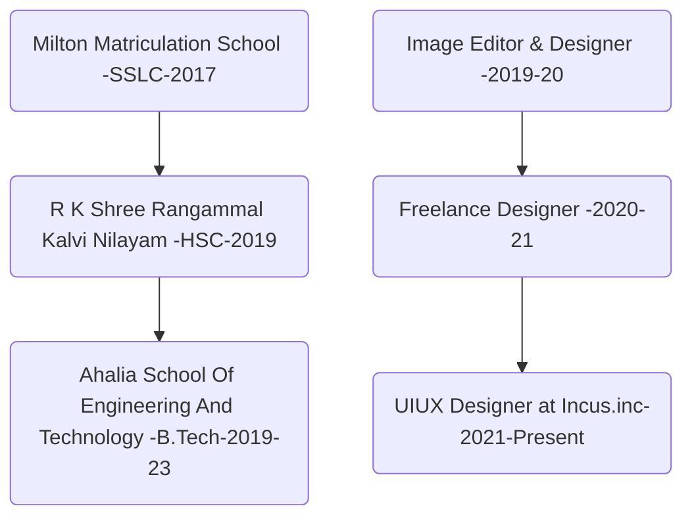

  

 

 
 

### `hello, World ❤️` 
## I’m **@hariprasd**   
 I’m a **Product Designer & Artist**  
 The Face behind [@DevignX ↗︎](https://github.com/devignx) - [Check Website ↗︎](https://devignx.herokuapp.com/)  
 Currently getting into **3D NFT creation & Motion Design**  
 Looking to collaborate on **UX & Tech Support, Web Development and Design Projects**  
 Contract based Projects are preferred   
 [Learn More About DevignX ↗︎](https://github.com/sponsors/hariprasd)
   

------

### **Short Description:**  

Click here

- I have *4 years* of Design experience and I have contributed to *25+ startups* in their Visual presence & Digital growth 🚀 
- I always loved to collaborate with the budding businesses & small scale startups ⚙️ 
- I have *3 year* experience in *UIUX Design* and I have *audited the Google's Professional Course on UXD* 
- I am professional with *Figma, Photoshop, Illustrator and whole Adobe suite, Blender,  and a mediocre developer & coder*   
- Learnt Technologies & Tools like Git, Heroku, Vercel, Node, AI & ML etc.. & Languages like Py, Js, C etc..

### **Education & Career**  

Click here

------

#### Contact for Collaborations 
#### Mobile +91 9345160259

------
Hari Prasad B ©   

## 📈 Stats

	
  
  

