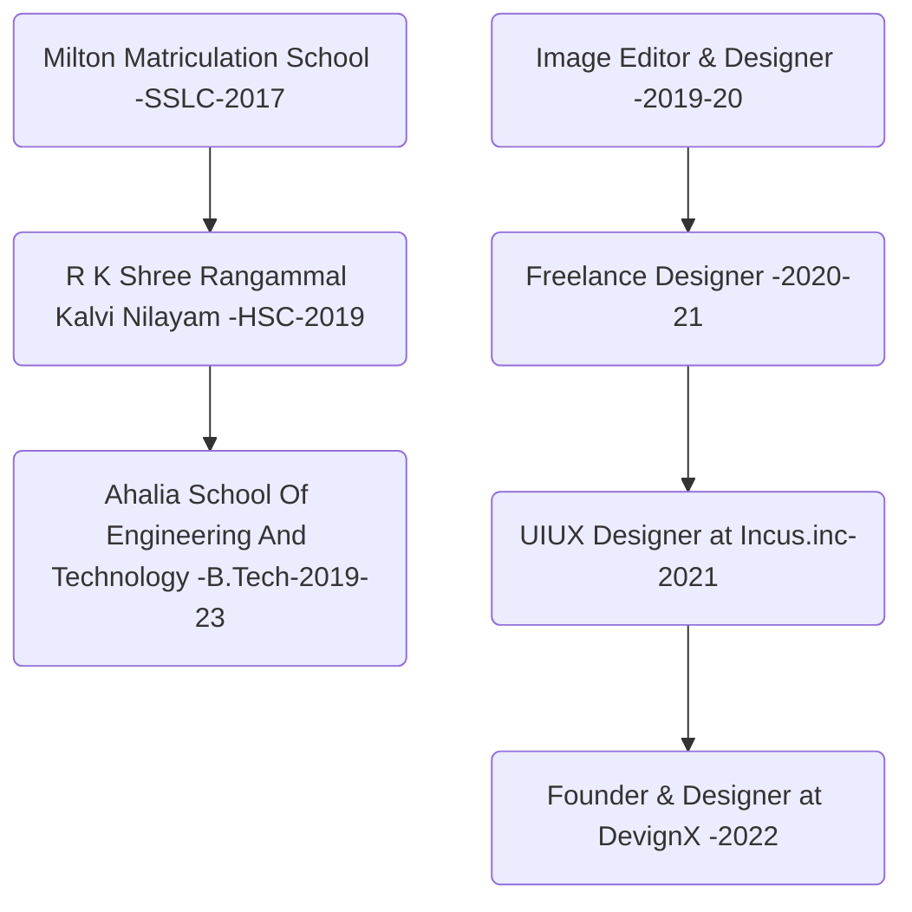

# I’m **@hariprasd**   

 

 
 

> ctrl + click these icons to open in new tab  

-----

 I’m an Ărtist and a **Product Designer**  
 The Face behind [@DevignX ↗︎](https://github.com/devignx) - [Check Website ↗︎](https://devignx.herokuapp.com/) - [Learn More About DevignX ↗︎](https://github.com/sponsors/hariprasd) 

#OpenToWork at

- Product Design (UIUX)
- Graphic Design
- Brand Design & Development Strategy
- Tech Support
- SEO & SMO
and more....

 

------

### **Short Description:**  

Click here

- I have *4 years* of Design experience and I have contributed to *25+ startups* in their Visual presence & Digital growth 🚀 
- I always loved to collaborate with the budding businesses & small scale startups ⚙️ 
- I have *4 year* experience in *UIUX Design* and I have *audited the Google's Professional Course on UXD* 
- I am professional with *Figma, Photoshop, Illustrator and whole Adobe suite, Blender,  and a mediocre developer & coder* 
- Learnt Technologies & Tools like Git, Heroku, Vercel, Node, AI & ML etc.. & Languages like Py, Js, C etc..   
Check my [cover letter ↗︎](https://github.com/hariprasd/hariprasd/blob/main/coverletter.md)  

### **Education & Career**  

Click here

------

#### Contact for Collaborations +91 9345160259  
Hari Prasad B ©   

  

## 📈 Stats

	
  
  

 

 PS: I made this README template open for all, give it a star, Use this as template & customize it for yourself 🚀  <a href="https://github.com/hariprasd/hariprasd/raw/main/readme-hariprasd.pdf">Click here to download this README as PDF ↓</a>

   

