 <a href='https://hariprasd.me' target='_blank'> </a>
 <h1><a href='https://hariprasd.me'>Hariprasad • Designer • Developer</a></h1>

<!-- 

 • 
 • 
 • 
• 
• 

 -->
 

I’m an Λrtist, a **Creative Designer** & a **Front End Dev** 
& I'm Leading [@DevignX ↗︎](https://github.com/devignx) - [Check Website ↗︎](https://devignx.tech/) - [Learn More About DevignX ↗︎](https://github.com/sponsors/hariprasd) 

I'm also a...

- Product Designer (UIUX)
- Front End developer (React, Next Js)
- Design Generalist (Branding, Graphics, 3d, Vector, wireframing, prototyping ...)
- Tech Consultant
- SEO & SMM Guy
and more....

### **Education & Career**

```mermaid
graph TD;
    A(Milton Matriculation School -SSLC-2017):::fb -->B(R K Shree Rangammal Kalvi Nilayam -HSC-2019):::fb;
    B(R K Shree Rangammal Kalvi Nilayam -HSC-2019):::fb-->C(Ahalia School Of Engineering And Technology -B.Tech-2019-23):::fb;
    D(Image Editor & Designer -2019-20):::fb-->E(Freelance Designer -2020-21):::fb;
    E(Freelance Designer -2020-21):::fb-->F(UIUX Designer at Incus.inc-2021):::fb;
    F(UIUX Designer at Incus.inc-2021):::fb-->G(Founder & Designer at DevignX -2022):::fb;
    G(Founder & Designer at DevignX -2022):::fb-->H(UIUX Developer at Metastart -2023):::fb;
    classDef fb fill:#000
```

Click here

------

#### Contact for Collaborations +91 9345160259
Hari Prasad B ©   

  

<!--
## 📈 Stats

	
  
  

-->
 

 PS: I made this README template open for all, give it a star, Use this repo as template & customize it for yourself 🚀  <a href="https://github.com/hariprasd/hariprasd/raw/main/readme-hariprasd.pdf">Click here to download this README as PDF ↓</a>

   

